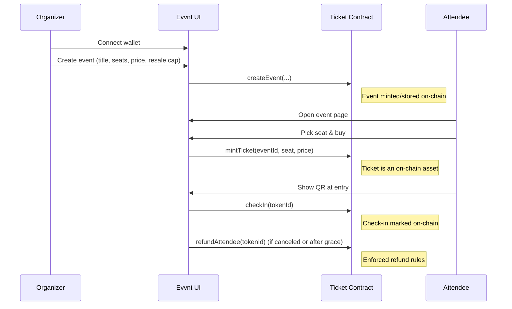

# Evvnt — Transparent Web3 Ticketing
## Media Uploads (Pinata/IPFS)
- All image uploads go through the Next.js API route `fe/src/app/api/ipfs/route.ts`, which forwards to Pinata.
- Set the server env `PINATA_JWT` (Vercel Project Settings → Environment Variables) to a valid Pinata JWT.
- Local development: you can temporarily set `PINATA_JWT` in `fe/.env.local` (do not commit secrets).
- Upload flow in code:
  - Frontend: `uploadToIPFS(file)` in `fe/src/lib/ipfs.ts`
  - Server: `POST /api/ipfs` handles `pinFileToIPFS` and `pinJSONToIPFS`
- Note: Web3.Storage is currently disabled in code to simplify setup and reduce friction.


Evvnt is a minimal, elegant Web3 ticketing platform. Organizers can create events with price/seat controls, attendees buy in seconds, and check-in is instant with on-chain verification.

This document is designed as a clear, hackathon-ready overview: architecture, product flow, smart contracts, and setup. It can double as a submission doc.


## TL;DR
- Transparent, fraud-proof tickets as on-chain assets
- Fair resale with price caps, instant transfer and check-in
- Minimal, performant Next.js frontend with modern UI/UX


## Live Contract (Testnet)
- Network: `somnia-testnet` (chainId: `50312`)
- Ticket contract: `0xc8966abd81cab4d2f683449912ca72ac0057ad48`
- Deployer/Owner: `0x3BFbE4E3dCC472E9B1bdFC0c177dE3459Cf769bf`
- Deployment record: `smart-contract/deployments/ticket-somnia-testnet.json`


## Architecture

```mermaid
flowchart LR
  subgraph Frontend [Next.js App (fe/)]
    UI[App Pages & Components]
    Hooks[useBlockchainIntegration]
    Wallet[WalletConnect]
  end

  subgraph Contracts [Smart Contracts (smart-contract/)]
    T[Ticket.sol]
  end

  UI --> Hooks
  Hooks <--> T
  Wallet --> Hooks
```

- Frontend (Next.js + TypeScript)
  - Directory: `fe/`
  - Pages:
    - `about/` — Landing with animated hero, product value, and animated How It Works
    - `events/` — Events marketplace (animated cyan hero, events grid)
    - `my-tickets/` — Owned tickets, QR verification link/QR generation
    - `organizer/` — Organizer dashboard (create events, view registrations, check-in, admin actions)
  - Components: `WalletConnect`, `EventCard`, `SeatSelection`, `OrganizerDashboard`, `HowItWorksSlider`, `Header`, `Footer`
  - Hooks: `useBlockchainIntegration` provides contract calls and handles chain I/O

- Smart Contracts (Foundry/Hardhat style structure)
  - Directory: `smart-contract/`
  - Core: `contracts/Ticket.sol` (single-ticketing protocol)
  - Scripts: `smart-contract/scripts/*` (deploy, approve organizer, etc.)
  - Deployment records: `smart-contract/deployments/*.json`


## Product Flow




## Key Features
- Organizer controls
  - Event creation with seat limits, price, resale cap
  - Cancellations, mark occurred, withdraw proceeds, view registrations
- Attendee experience
  - Seat selection, instant mint/transfer
  - My Tickets: QR + verification link
  - Refunds if canceled or after grace period (48h) when not marked occurred
- Security
  - On-chain uniqueness and ownership
  - Check-in on-chain (prevents re-use)
  - Resale price caps enforced in contract logic
- UX
  - Modern, minimal design with subtle animations
  - Animated cyan hero for events, Ken Burns hero on landing
  - Reduced-motion support for accessibility


## Frontend Directory Map
```
fe/
  public/
    bg.jpg
  src/
    app/
      about/
      events/
      my-tickets/
      organizer/
      layout.tsx
      globals.css
    components/
      Header.tsx, Footer.tsx, EventCard.tsx, SeatSelection.tsx,
      OrganizerDashboard.tsx, WalletConnect.tsx,
      HowItWorksSlider.tsx
    hooks/
      useBlockchainIntegration.ts
```


## Contract Mechanics (Ticket.sol)
- Each event is stored with:
  - `price`, `maxTickets`, `tickets` (remaining), `organizer`, `eventTimestamp`, `maxResalePrice`, `escrowBalance`
- Purchase flow
  - `mintTicket(eventId, seatNumber, price)` mints the ticket asset
  - Enforces pricing and seat availability
- Check-in
  - `checkIn(tokenId)` marks a ticket as used, preventing re-entry
- Refunds
  - Allowed if event canceled, or after grace (`48h`) if organizer hasn’t marked occurred
- Organizer admin
  - `cancelEvent`, `markEventOccurred`, `withdrawOrganizer`


## Setup & Run

### Prerequisites
- Node.js 18+
- pnpm or npm
- Wallet (MetaMask)

### Frontend
```
cd fe
pnpm install
pnpm dev
# or
npm install
npm run dev
```
- Development server: http://localhost:3000
- Update chain config if needed in `fe/src/hooks/useBlockchainIntegration.ts`

### Smart Contracts (optional)
- Review `smart-contract/` for deployment scripts and addresses
- Update `deployments/*.json` when deploying to new networks


## Environment Variables
Create `fe/.env.local` if required (example values):
```
NEXT_PUBLIC_CHAIN_ID=50312
NEXT_PUBLIC_TICKET_ADDRESS=0xc8966abd81cab4d2f683449912ca72ac0057ad48
NEXT_PUBLIC_RPC_URL= <somnia_testnet_rpc>
# Server-side only (for uploads via Pinata; do NOT commit real secrets)
PINATA_JWT= <pinata_jwt_token>
```


## Verification & QR
- The My Tickets page generates a QR linking to `/verify?tokenId=<id>&eventId=<id>`
- A simple verify view can read owner/checked-in status via `useBlockchainIntegration`
- Staff scans QR and `checkIn` is performed by authorized roles (as configured)


## Security & Compliance
- Reduced motion, accessible color contrast, and keyboard nav friendly
- No private keys stored; all signing in wallet
- Potential auditing points:
  - Resale cap enforcement
  - Check-in authorization controls
  - Withdrawal and escrow balance integrity


## Performance & Scalability
- Static/SSR hybrid via Next.js App Router
- Lightweight, dependency-minimal UI components
- Easily shard events across pages and lazy-load details


## Roadmap
- Multi-network deployment and fallback RPCs
- Email/SMS ticket delivery adapters
- Organizer teams & roles
- Analytics dashboard and CSV exports
- Inline seat map visualization


## Team & Contributors
- Built by the Evvnt team — contributions welcome via PRs.


## License
- MIT (or specify your preferred license)
